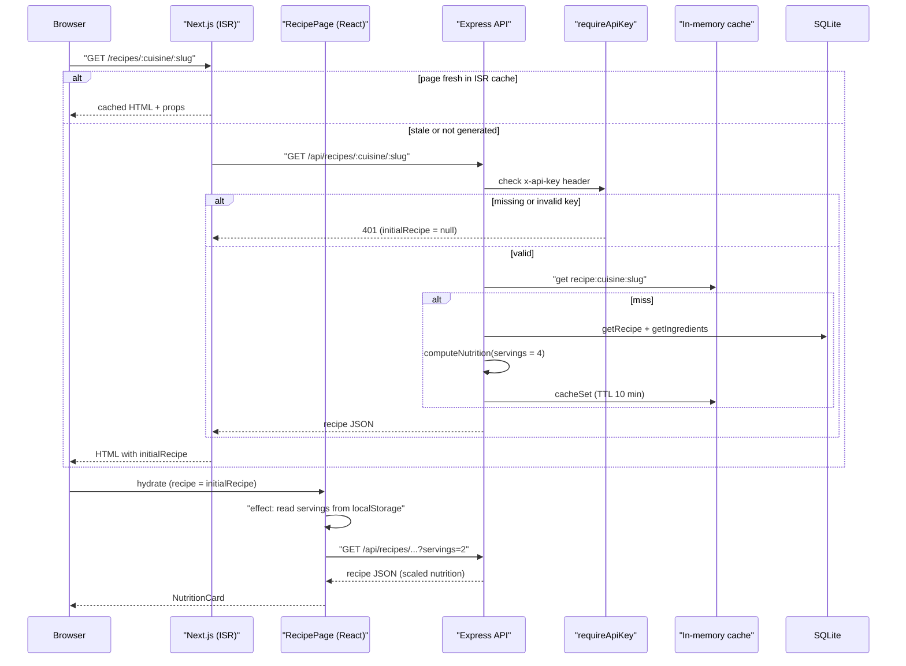

# trace-flow

A [Claude Code](https://claude.com/claude-code) skill that traces one feature flow through your codebase — from its entry point to its final effects — and returns a **curated, verified** diagram.

> "Trace the login flow" → Mermaid sequence diagram + step table with `file:line` for every step.

## Why

Full call graphs are unreadable. `trace-flow` keeps only the steps that matter:

- boundary crossings (HTTP, DB, cache, queues, external APIs)
- state changes (sessions, tokens, writes)
- decisions (error branches that change the outcome)
- security-relevant steps (auth, hashing, token validation)

It also resolves the hidden parts that static tools miss, such as middlewares, dependency injection, events, and interface → implementation. Every step is anchored to a real `file:line`, and anything it can't verify is listed explicitly instead of guessed.

## Install

```
/plugin marketplace add minim/trace-flow
/plugin install trace-flow@trace-flow
```

Or copy `plugins/trace-flow/skills/trace-flow/` into `~/.claude/skills/` for a personal install.

## Usage

Just ask in natural language:

```
trace the login flow
what happens when a user uploads a file?
diagrama del flujo de reset de contraseña
```

Or invoke it directly:

```
/trace-flow:trace-flow checkout happy-path
```

Options: `happy-path`, `detailed`, `flowchart` / `sequence`, `from <X>` / `to <Y>`.

## Output

1. Summary
2. Mermaid diagram (sequence or flowchart, with error branches)
3. Step table (`# | Step | Location | Notes`)
4. Gaps & assumptions
5. Drill-down offers

The diagram is a standard ```` ```mermaid ```` block: it renders on GitHub, GitLab, Obsidian, VS Code (Markdown preview) and [mermaid.live](https://mermaid.live), so you can paste it anywhere.

### Example

> *Fictional project for illustration: a recipe site (`recipes-web`, Next.js) backed by `recipes-api` (Express + SQLite).*
>
> **Prompt:** `trace the flow from opening a recipe page until its nutrition facts are shown`

**Summary**: `/recipes/[cuisine]/[slug]` is rendered with ISR (`revalidate: 600`) from `GET /api/recipes/:cuisine/:slug`. After hydration the page fetches the same endpoint again with the user's serving size, and the nutrition card is drawn from that second response.



**Steps**

| # | Step | Location | Notes |
|---|------|----------|-------|
| 1 | Paths pre-rendered for the 50 most-viewed recipes | `recipes-web/pages/recipes/[cuisine]/[slug].js:40-62` | `fallback: 'blocking'` |
| 2 | `getStaticProps` fetches the recipe | `recipes-web/pages/recipes/[cuisine]/[slug].js:65-81` | Errors are swallowed and `initialRecipe` becomes `null` |
| 3 | API client adds the API key header on the server | `recipes-web/lib/api.js:3-12` | Key read from `RECIPES_API_KEY` (value not shown) |
| 4 | `requireApiKey` runs on every route | `recipes-api/src/app.js:14`, `src/middleware/apiKey.js:5-19` | Compares with `==` against the env var |
| 5 | Cache lookup | `recipes-api/src/routes/recipes.js:22-26` | Key ignores `servings` ⚠️ |
| 6 | DB queries | `recipes-api/src/db/recipes.js:31-58` | Two queries, no transaction |
| 7 | Nutrition computed per serving | `recipes-api/src/nutrition.js:10-44` | Defaults to 4 servings |
| 8 | Servings read from `localStorage` after mount | `recipes-web/pages/recipes/[cuisine]/[slug].js:102-108` | Triggers step 9 |
| 9 | Client refetch with `?servings=` | `recipes-web/pages/recipes/[cuisine]/[slug].js:110-124` | Shows a skeleton while loading |
| 10 | Nutrition card rendered | `recipes-web/components/NutritionCard.js:8-37` | |

**Gaps & assumptions**

- **Cache bug**: the cache key in step 5 does not include `servings`, so a cached response for 4 servings is also returned for `?servings=2`. The nutrition shown can be wrong for up to 10 minutes.
- **Browser requests have no API key**: `lib/api.js` only adds the header on the server. On a strict deployment the client call in step 9 would get a 401. I assumed a dev setup where the check is relaxed (`NODE_ENV !== 'production'`, `apiKey.js:6`). This is inferred, not tested.
- `computeNutrition` calls a units helper (`convertUnit`) that is loaded dynamically by name (`nutrition.js:27`). It is unresolved and not traced.

**Drill-down**: the ISR revalidation, the ingredient unit conversion, or the API key check.

The skill is read-only: it never modifies your code or copies secret values into its output.

## License

MIT
